# eBanking

The Bank Management Application is a web-based application built with ASP.NET Core MVC, designed to manage bank accounts and transactions. It utilizes the MySQL database to store the account and transaction data.

## Table of Contents

- [Installation](#installation)
- [Usage](#usage)
- [Database Configuration](#database-configuration)
- [Contributing](#contributing)
- [Database Design](#database-design)
- [App Interface](#app-interface)
- [Banking Regulations](#banking-regulations)

## Installation

1. Clone the repository: `git clone https://github.com/divitcr7/Advanced-Banking-Architecture---eBanking.git`
2. Open the project in your preferred development environment (e.g., Visual Studio)
3. Build the solution to restore NuGet packages and compile the project

## Usage

1. Configure the database connection string in the `appsettings.json` file
2. Run the project (e.g., press F5 in Visual Studio) to start the application
3. Open your web browser and visit: `http://localhost:[port]` (replace `[port]` with the appropriate port number)

## App Interface

<div style="display: grid; grid-template-columns: repeat(3, 1fr); gap: 10px;">
    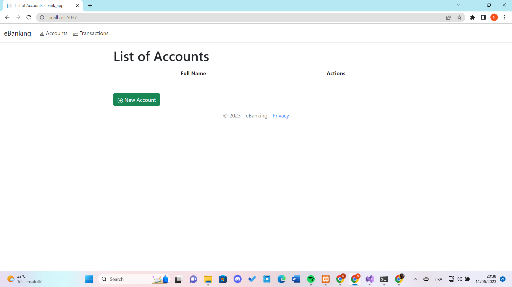
    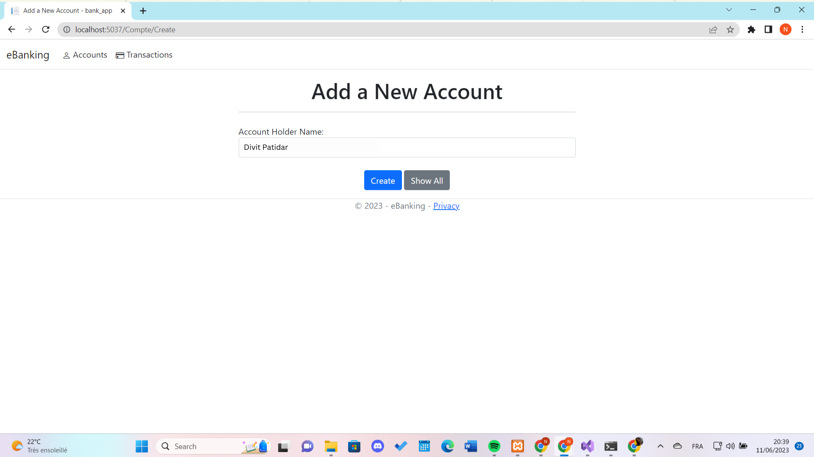
    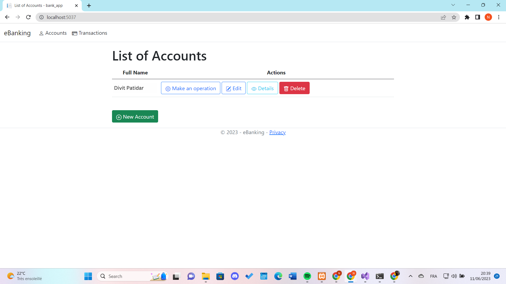
    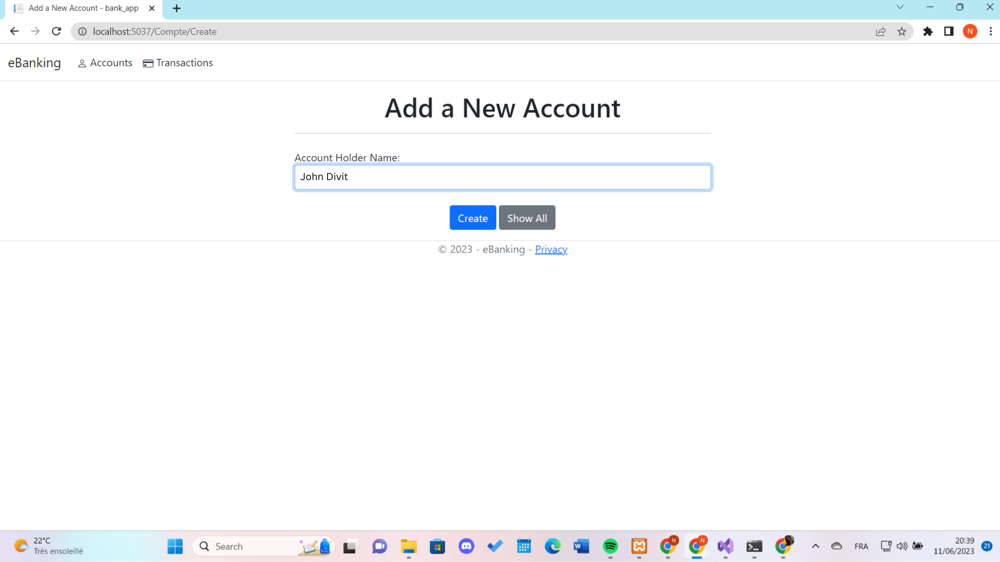
    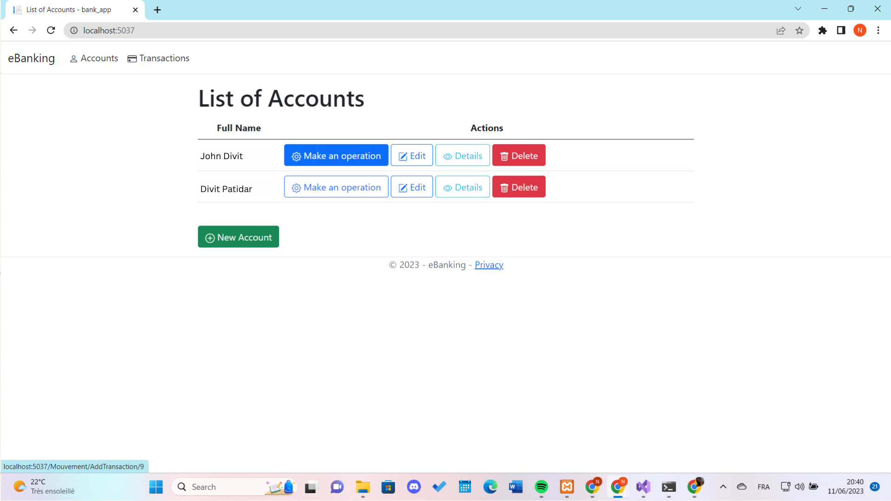
    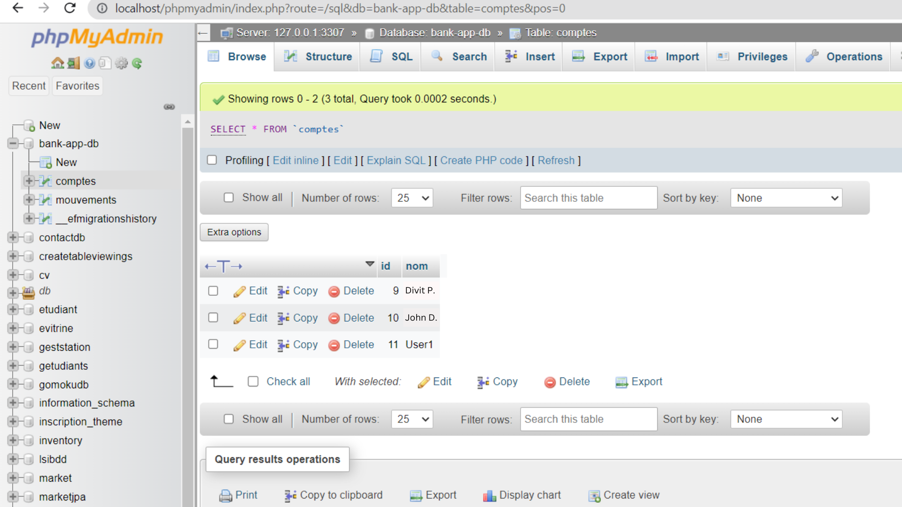
    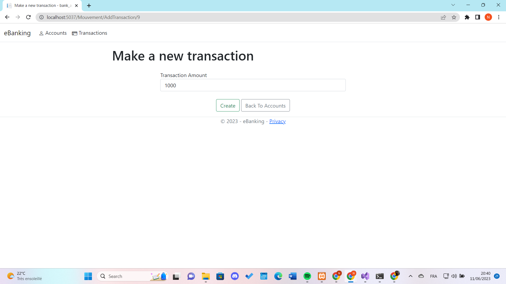
    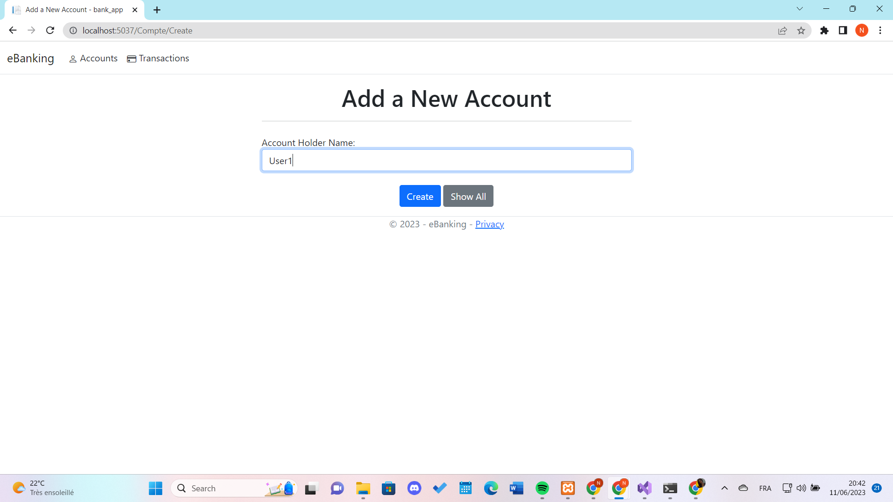
    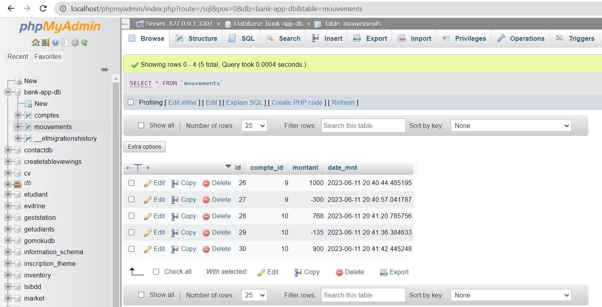
    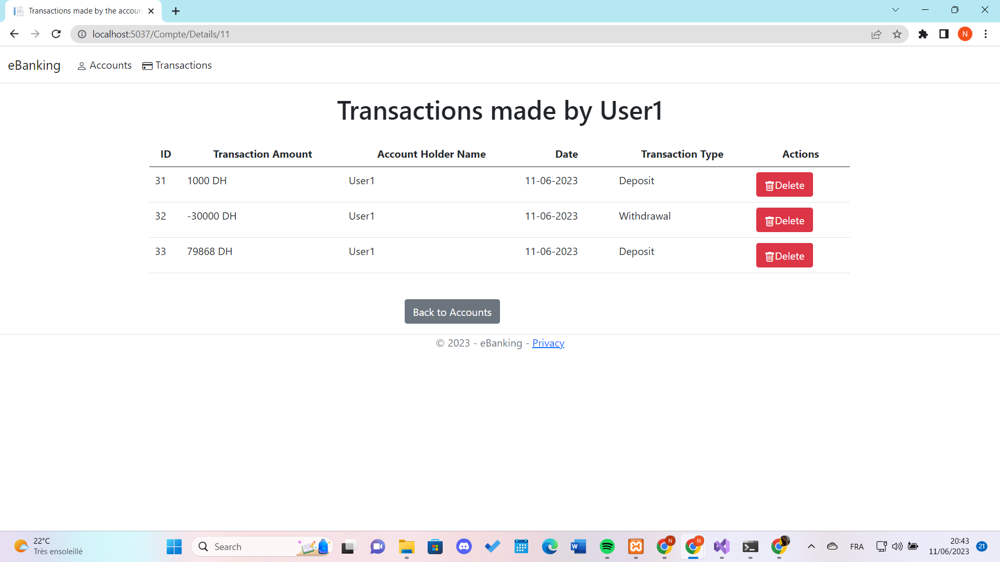
    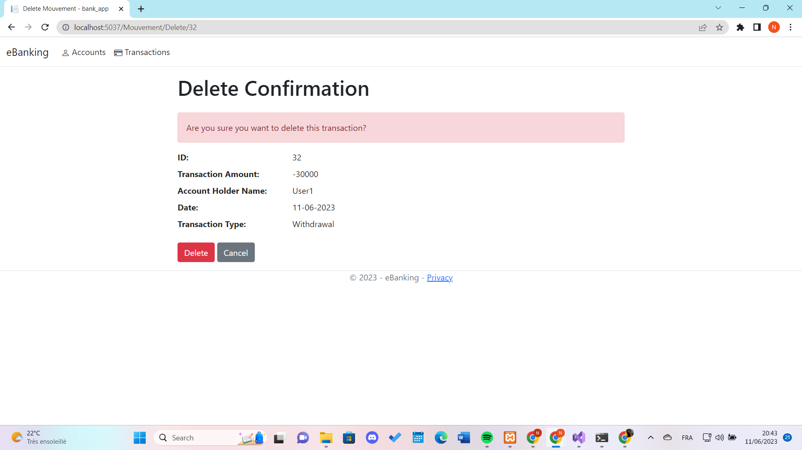
    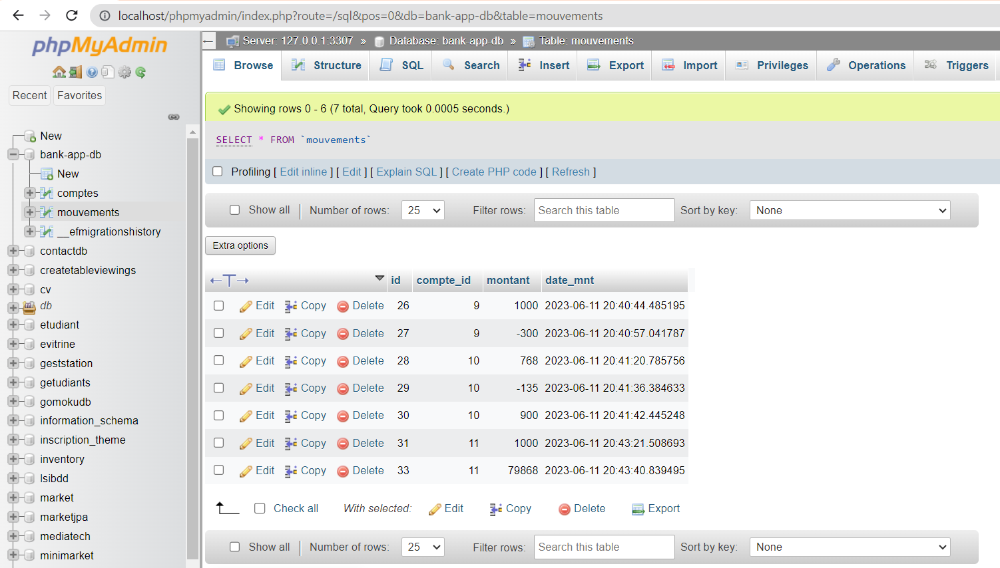
    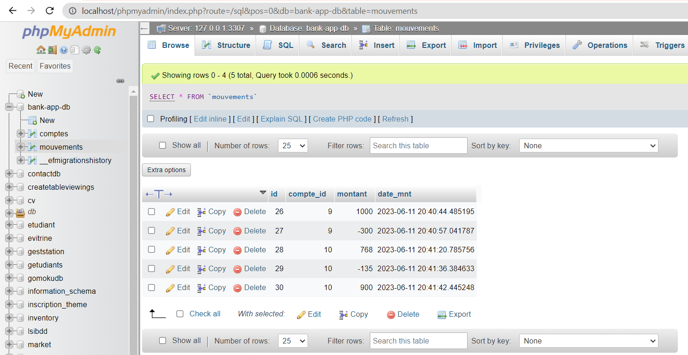
    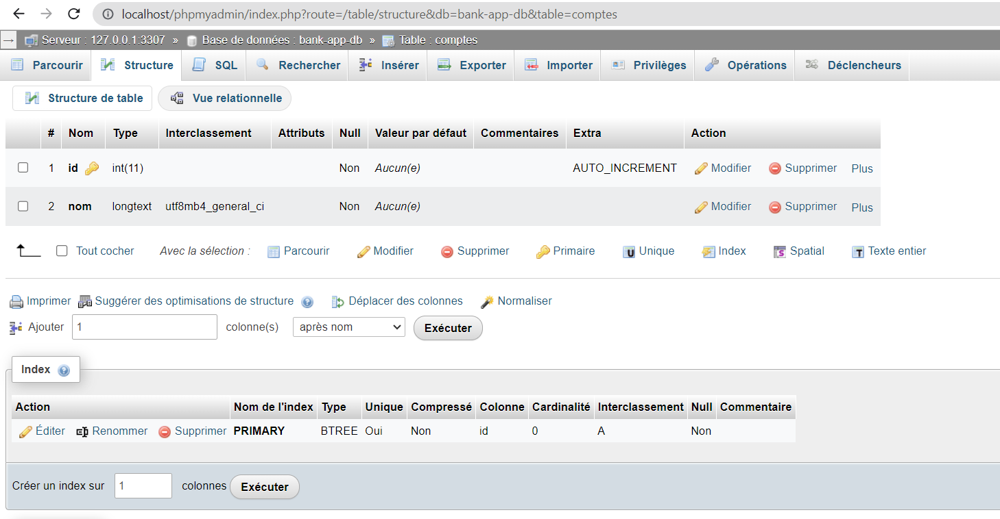
    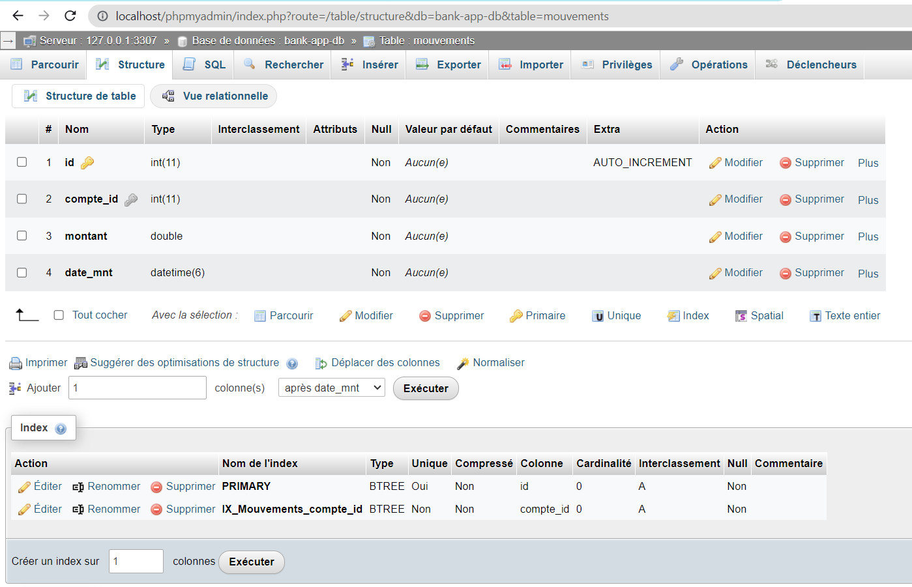
    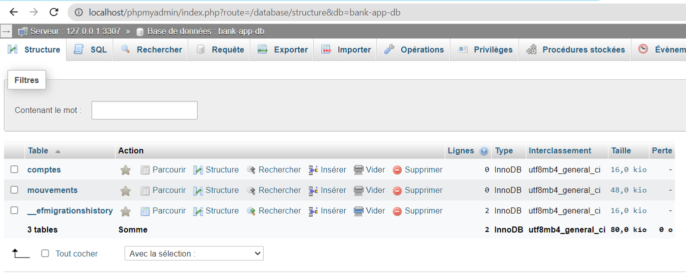
</div>

## One Click Integration


Our One Click Integration feature adheres to all relevant banking regulations and security standards. This ensures a seamless and compliant integration process for our banking services. We prioritize data protection, user privacy, and secure transactions in full compliance with financial industry regulations.

## Database Configuration

1. Install XAMPP: Download and install XAMPP from the [official website](https://www.apachefriends.org/index.html).
2. Start the XAMPP Control Panel: Launch the XAMPP Control Panel to start the Apache and MySQL services.
3. Access phpMyAdmin: Open your web browser and visit `http://localhost/phpmyadmin`.
4. Create a new database: Click on "Databases" tab in phpMyAdmin, enter a name for your database, and click "Create" to create a new database for the application.
5. Update the connection string: Open the appsettings.json file in your project and modify the database connection string with the following details:

```json
"ConnectionStrings": {
  "MyConn": "Server=localhost;Port=3306;Database=[database name];Uid=root;Pwd=[password];"
}
